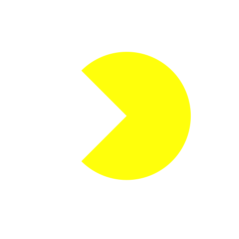

I don't care what Karl says: piecharts are awesome
```{r, include=FALSE}
library(animation)
saveGIF({
  N=25
  for(i in 0:(N-1)){ 
    x=cos(2*pi/N*i);y=x+1;z=(y-2)*22.5
    pie(c(y,8-y),col=c("white","yellow"),init.angle=135-z,border=FALSE,labels=NA)
    }
},'pacman.gif', outdir=getwd(), interval = .025) ##mwahahaha i just clobbered your pacman.gif file
```


